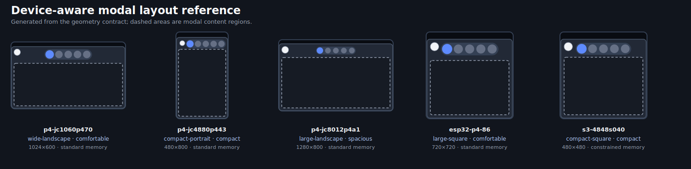

# Modal Layout System

EspControl modals share one architecture while keeping deliberate differences
for each display family. Device identity is not inspected inside modal code.

## Ownership

The modal system is split into five layers:

1. `devices/catalog.json` assigns each device a semantic modal profile: layout
   family, density, memory tier, and base touch target.
2. `scripts/generate_device_slots.py` writes that profile into generated device
   YAML and `GridConfig` activates it when the grid is built.
3. `button_grid_modal_layout.h` calculates frames, tab rails, and content
   regions without LVGL or ESPHome dependencies.
4. `button_grid_modal.h` adapts those plans to LVGL and owns the common shell,
   chrome, active-modal state, nested menus, and dismissal policy.
5. Card-specific headers own entity state, actions, labels, and the controls
   placed inside the planned content region.

This boundary keeps device optimisation explicit and keeps domain behaviour out
of the shared geometry layer.

## Device Profiles

The current layout families are:

| Family | Intended shape | Current device class |
|---|---|---|
| `wide-landscape` | Short, wide displays | 7-inch landscape |
| `compact-portrait` | Narrow portrait displays | 4.3-inch portrait |
| `large-landscape` | High-resolution wide displays | 10.1-inch landscape |
| `large-square` | Higher-resolution square displays | 4-inch P4 square |
| `compact-square` | Small square displays | 4-inch S3 square |

Density and memory tier are separate from geometry so a future device can reuse
the same family while selecting different spacing or constrained rendering. Do
not add a device model or exact resolution check to modal code. Add a profile or
an explicit semantic capability instead.

## Modal Definitions and Lifecycle

Every `ControlModalKind` has one `ControlModalDefinition`. The definition owns:

- its presentation recipe;
- whether the shell shows back or close chrome;
- whether display takeover may dismiss it.

Only one primary modal is active. Opening a shell closes the previous primary
modal, and navigation asks the controller to close the active modal rather than
calling every modal type manually. Nested menus have their own single active
slot and close before their parent.

Critical alarm controls declare that display takeover must preserve them.
Ordinary and interactive modals are dismissed before sleep, clock, or another
display takeover is applied.

## Layout Recipes

The pure layout planner currently exposes three composable recipes:

- frame: panel bounds, insets, back button, arc, and primary controls;
- tabs: touch sizes, selected size, spacing, back-button clearance, and content
  gap;
- content: usable top, bottom, width, height, and vertical centre.

Card code may still optimise the controls inside a content region, but it must
not repeat the shared frame or tab calculations. Repeated LVGL surfaces, such as
the tab row, belong in `button_grid_modal.h`.

## Regression Contract

`common/config/modal_layout_geometry_fixtures.json` records the exact geometry
for every unique supported display profile. The check compiles and runs the
real C++ planner on the host, verifies bounds and clearance invariants, and
compares exact frame, tab, and content results.

The same fixture generates this reviewable reference:



Run the focused contract with:

```bash
npm run check:firmware-modal-layouts
```

If a visible layout change is intentional, update the fixture, regenerate the
reference with `python3 scripts/generate_modal_layout_reference.py`, compile all
devices, and call out the physical display checks required in the pull request.

## Adding a Modal

1. Add the modal kind and its central definition.
2. Open it through `control_modal_open_shell(...)` and provide one cleanup
   callback.
3. Use a shared layout recipe; extend the pure planner if a reusable recipe is
   missing.
4. Keep Home Assistant state and actions in the owning card header.
5. Extend the modal checks when the new type introduces a lifecycle or geometry
   invariant.
6. Compile every supported device and test the smallest relevant display.
